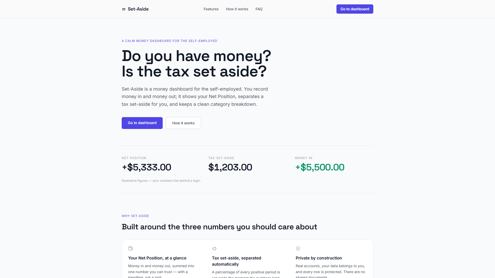
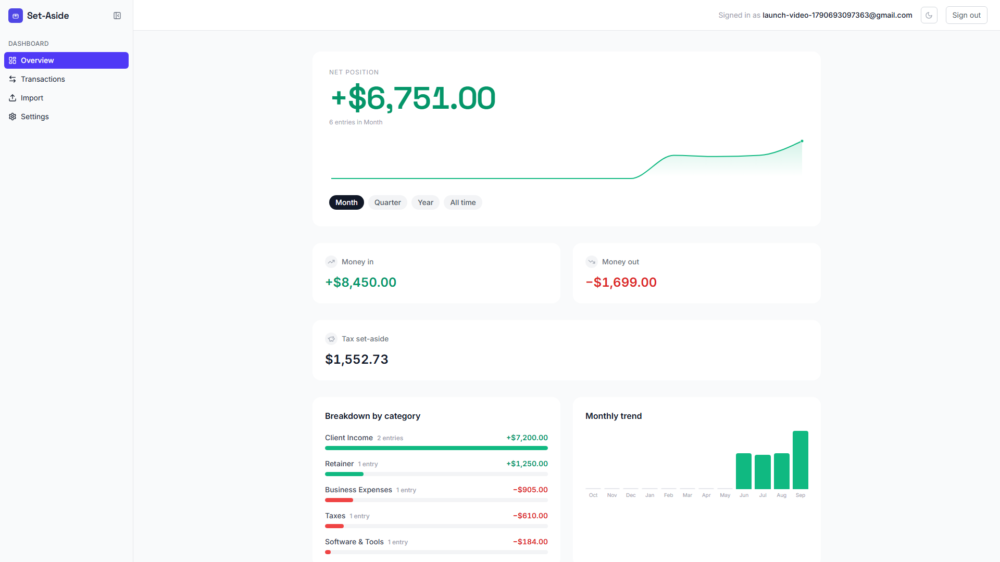
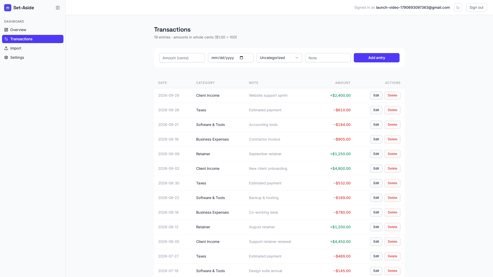
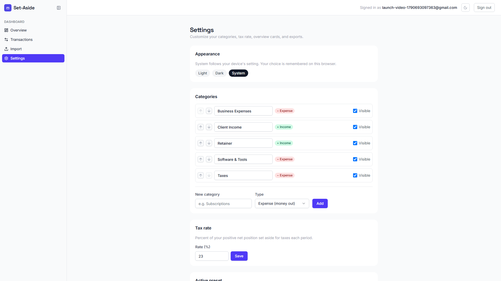

<div align="center">


</div>

<br/>

<p align="center">
  <svg width="56" height="56" viewBox="0 0 48 48" fill="none" xmlns="http://www.w3.org/2000/svg">
    <rect x="8" y="14" width="32" height="24" rx="6" stroke="#10B981" stroke-width="3.2"/>
    <path d="M8 23.4h32" stroke="#10B981" stroke-width="3.2"/>
    <circle cx="24" cy="23.2" r="5.4" fill="#4F46E5" stroke="#4F46E5"/>
  </svg>
</p>

<h1 align="center">
  <svg width="44" height="44" viewBox="0 0 24 24" fill="none" stroke="#10B981" stroke-width="1.7" stroke-linecap="round" style="vertical-align:middle"><rect x="4.5" y="8" width="15" height="11.5" rx="2.6"/><path d="M4.5 12.4h15"/><circle cx="12" cy="12.3" r="2.4" fill="#4F46E5" stroke="none"/></svg>&nbsp;&nbsp;Set-Aside
</h1>

<p align="center"><b>A calm money dashboard for the self-employed.</b><br/>
Record money in and money out. Set-Aside shows your Net Position, separates your tax <i>for you</i>, and keeps a clean category breakdown — trendline, not a grid.</p>

<p align="center"><i>"Do you have money? Is the tax set aside?"</i></p>

---

## The workflow

Sign up with a magic link, pick a preset, record money in and out — the ledger does the rest.

<p align="center">
  
</p>

- **One number.** Money in, money out, summed into a Net Position you can trust — a trendline, not a grid.
- **Presets seed your categories.** Freelance, Business, Personal, or Creator, chosen once at sign-up.
- **The tax is set aside for you.** A share of every positive period is separated at your rate (23% is the common default).
- **Private by construction.** Supabase Row Level Security guards every owned table; there are no shared documents.

<details><summary>Full walkthrough</summary>

<p align="center"><sub>Signup via magic link → picking a preset → the dashboard → recording an entry → settings.</sub></p>

<p align="center">
  <video width="100%" autoplay loop muted playsinline>
    <source src="https://github.com/N0teveryth1ng/Set_ASIDE/releases/download/video-v1/set-aside-launch.mp4" type="video/mp4" />
  </video>
</p>

<p align="center">▸ Video lives at <code>docs/media/set-aside-launch.mp4</code> (55s, 1080p) · cinematic cut at <code>docs/media/set-aside-premiere.mp4</code> (40s, 1080p60)</p>

</details>

## Why Set-Aside

Freelancers and small operators don't need a general ledger or an accountant — they need one honest number. Set-Aside is deliberately narrow:

- **No company setup, no accounting jargon.** A magic link is all it takes to sign in.
- **One screen, always up to date.** Overview, transactions, import, and settings. No spreadsheets to babysit, no "dashboard" that only a bookkeeper reads.
- **A tax answer you can't forget.** A percentage of every *positive* period is set aside the moment the numbers land.

## Features

| | |
|---|---|
| <svg width="18" height="18" viewBox="0 0 24 24" fill="none" stroke="#059669" stroke-width="2" stroke-linecap="round" stroke-linejoin="round"><path d="M21 12V7H5a2 2 0 0 1 0-4h14v4"/><path d="M3 5v14a2 2 0 0 0 2 2h16v-5"/><path d="M18 12a2 2 0 0 0 0 4h4v-4Z"/></svg> | **Your Net Position, at a glance** — money in and money out summed into one number you can trust, with a trendline instead of a grid. |
| <svg width="18" height="18" viewBox="0 0 24 24" fill="none" stroke="#059669" stroke-width="2" stroke-linecap="round" stroke-linejoin="round"><path d="M19 5c-1.5 0-2.8 1.4-3 2-3.5-1.5-11-.3-11 5 0 1.8 0 3 2 4.5V20h4v-2h3v2h4v-4c1-.5 1.7-1 2-2h2v-4h-2c0-1-.5-1.5-1-2V7z"/><path d="M2 9v1c0 1.1.9 2 2 2h1"/><path d="M16 11h.01"/></svg> | **Tax set-aside, separated automatically** — pick a rate (23% is a common default); every positive period sets that share aside on its own. |
| <svg width="18" height="18" viewBox="0 0 24 24" fill="none" stroke="#059669" stroke-width="2" stroke-linecap="round" stroke-linejoin="round"><path d="M20 13c0 5-3.5 7.5-7.66 8.95a1 1 0 0 1-.67-.01C7.5 20.5 4 18 4 13V6a1 1 0 0 1 1-1c2 0 4.5-1.2 6.24-2.72a1.17 1.17 0 0 1 1.52 0C14.51 3.81 17 5 19 5a1 1 0 0 1 1 1z"/><path d="m9 12 2 2 4-4"/></svg> | **Private by construction** — real accounts, your rows belong to you. Supabase Row Level Security on every owned table; there are no shared documents. |
| <svg width="18" height="18" viewBox="0 0 24 24" fill="none" stroke="#4F46E5" stroke-width="2" stroke-linecap="round" stroke-linejoin="round"><rect width="18" height="7" x="3" y="3" rx="1"/><rect width="9" height="7" x="3" y="14" rx="1"/><rect width="5" height="7" x="16" y="14" rx="1"/></svg> | **Pick your money life** — Freelance, Business, Personal, or Creator presets seed your categories in one step. |
| <svg width="18" height="18" viewBox="0 0 24 24" fill="none" stroke="#4F46E5" stroke-width="2" stroke-linecap="round" stroke-linejoin="round"><path d="M15 2H6a2 2 0 0 0-2 2v16a2 2 0 0 0 2 2h12a2 2 0 0 0 2-2V7Z"/><path d="M14 2v4a2 2 0 0 0 2 2h4"/><path d="M12 12v6"/><path d="m15 15-3-3-3 3"/></svg> | **Import months of history** — CSV import with a preview and per-row flags (skip/duplicate/amount source) before anything is committed. |
| <svg width="18" height="18" viewBox="0 0 24 24" fill="none" stroke="#4F46E5" stroke-width="2" stroke-linecap="round" stroke-linejoin="round"><path d="M15 2H6a2 2 0 0 0-2 2v16a2 2 0 0 0 2 2h12a2 2 0 0 0 2-2V7Z"/><path d="M14 2v4a2 2 0 0 0 2 2h4"/><path d="M12 12v6"/><path d="m15 15-3 3-3-3"/></svg> | **Export when you need it** — CSV or a clean print-ready PDF report for a date range. |
| <svg width="18" height="18" viewBox="0 0 24 24" fill="none" stroke="#4F46E5" stroke-width="2" stroke-linecap="round" stroke-linejoin="round"><path d="M2 18v3c0 .6.4 1 1 1h4v-3h3v-3h2l1.4-1.4a6.5 6.5 0 1 0-4-4Z"/><circle cx="16.5" cy="7.5" r=".5" fill="#4F46E5"/></svg> | **No passwords to manage** — Google OAuth or email magic link, with refreshed sessions carried through redirects. |
| <svg width="18" height="18" viewBox="0 0 24 24" fill="none" stroke="#4F46E5" stroke-width="2" stroke-linecap="round" stroke-linejoin="round"><path d="M12.22 2h-.44a2 2 0 0 0-2 2v.18a2 2 0 0 1-1 1.73l-.43.25a2 2 0 0 1-2 0l-.15-.08a2 2 0 0 0-2.73.73l-.22.38a2 2 0 0 0 .73 2.73l.15.1a2 2 0 0 1 1 1.72v.51a2 2 0 0 1-1 1.74l-.15.09a2 2 0 0 0-.73 2.73l.22.38a2 2 0 0 0 2.73.73l.15-.08a2 2 0 0 1 2 0l.43.25a2 2 0 0 1 1 1.73V20a2 2 0 0 0 2 2h.44a2 2 0 0 0 2-2v-.18a2 2 0 0 1 1-1.73l.43-.25a2 2 0 0 1 2 0l.15.08a2 2 0 0 0 2.73-.73l.22-.39a2 2 0 0 0-.73-2.73l-.15-.08a2 2 0 0 1-1-1.74v-.5a2 2 0 0 1 1-1.74l.15-.09a2 2 0 0 0 .73-2.73l-.22-.38a2 2 0 0 0-2.73-.73l-.15.08a2 2 0 0 1-2 0l-.43-.25a2 2 0 0 1-1-1.73V4a2 2 0 0 0-2-2z"/><circle cx="12" cy="12" r="3"/></svg> | **Yours to adjust** — tax rate, active preset, currency display, categories, and which cards you see, all from Settings. |

## Showcase

| | |
|---|---|
|  | Landing |
|  | Overview — Net Position, money in/out, tax set-aside |
|  | Transactions |
|  | Settings |

## The shape of the system

```
┌─────────────────────────────────────────────────┐
│ UI          Next.js App Router (React 18)        │
│             /login · /dashboard/*                │
├─────────────────────────────────────────────────┤
│ API         Route handlers                       │
│             /api/entries · /api/summary          │
│             /api/import · /api/import/confirm    │
│             /api/settings · /api/export          │
├─────────────────────────────────────────────────┤
│ DOMAIN      lib/ledger — pure, unit-tested       │
│             computeTotals · computeTaxSetAside   │
│             groupByCategory · trendSeries        │
├─────────────────────────────────────────────────┤
│ DATA        Supabase (Postgres via Prisma)       │
│             Auth + Row Level Security            │
└─────────────────────────────────────────────────┘
```

### The domain layer is small and honest

```ts
// lib/ledger/ — pure functions, typed, zero React, zero I/O
type Period = "month" | "quarter" | "year" | "all";

computeTotals(entries, period);        // { in, out, net, count } — integer cents
computeTaxSetAside(entries, rate);     // rate applied to net positive in the period
groupByCategory(entries);              // sorted by |net| desc, empty categories kept
trendSeries(entries, months);          // one { month, in, out, net } per calendar month
```

Every amount is **integer cents** — no float drift, no "why is my total off by 0.01?". Sign rule: OUT → negative, IN → positive; Net Position is the arithmetic sum.

Security invariant, enforced from day one: **a user can never see another user's rows, even by guessing an ID** — every owned table carries `user_id`, and all access flows through sessions with RLS.

## Tech stack

- **Framework** — [Next.js](https://nextjs.org/) 14 (App Router), React 18, TypeScript 5.6
- **Styling** — Tailwind CSS + Radix UI primitives + `lucide-react`
- **Charts** — Recharts
- **Backend** — Supabase Auth (Google OAuth + magic link), Supabase Postgres on Prisma 7 (`@prisma/adapter-pg`), Row Level Security
- **Import/export** — Papaparse (CSV), SheetJS (XLSX), print-to-PDF report
- **Tests** — Node's built-in test runner with a Next server fixture

---

## Getting started

> **Prereqs**: Node 20+, a [Supabase](https://supabase.com) project (Auth + Postgres). The local test suite round-trips against live Supabase, so keep your real project keys handy for `npm test`.

```bash
git clone https://github.com/N0teveryth1ng/Set_ASIDE.git
cd Set_ASIDE
npm install
```

Create `.env` from the example and fill in real values:

```bash
cp .env.example .env
```

```env
# Supabase → Settings → Database (connection string)     [session pooler]
DATABASE_URL="postgresql://postgres.<project-ref>:<db-password>@aws-0-ap-southeast-1.pooler.supabase.com:5432/postgres?sslmode=require"

# Supabase → Settings → API Keys → "Publishable and secret API keys"
NEXT_PUBLIC_SUPABASE_URL="https://<project-ref>.supabase.co"
NEXT_PUBLIC_SUPABASE_ANON_KEY="sb_publishable_..."
```

Run it:

```bash
npm run dev        # http://localhost:3000
```

### Scripts

| Script | What it does |
|---|---|
| `npm run dev` | Start the dev server (`next dev`) |
| `npm run build` | Production build (`next build`) |
| `npm run start` | Serve the production build |
| `npm run lint` | ESLint (`next lint`) |
| `npm test` | Unit + integration tests (`lib/**/*.test.ts`, Node test runner) |
| `npm run db:seed` | Seed the database (`prisma/seed.ts`) |

### Testing

```
ℹ pass 86 · ✕ fail 0 · duration ~700 ms
```

`npm test` runs the pure `lib/ledger` suite plus live round-trips against Supabase — including middleware session handling through the signed-in redirect path — with a real session cookie carried and the throwaway test user cleaned up afterwards.

## Roadmap

- [x] Landing, auth (magic link + Google), onboarding presets
- [x] Overview, transactions, settings
- [x] CSV import with preview + confirmation
- [x] Export to CSV / print-ready PDF
- [x] Launch video (walkthrough + cinematic cut)
- [ ] Account menu + `/dashboard/profile`
- [ ] Trim leading empty months from the hero trendline

## Contributing

PRs welcome. The project favors squashed commits and small, reviewable changes — a diff shown before the merge is the house style. When contributing:

- keep `lib/ledger` pure and unit-tested (new math goes through `lib/**/*.test.ts`)
- never commit secrets, `.env`, or scratch files (see `.gitignore`)
- keep every owned row behind RLS

## License

`private` — all rights reserved. This is an internal/source-available project: you may read and learn from it, but redistribution requires permission.